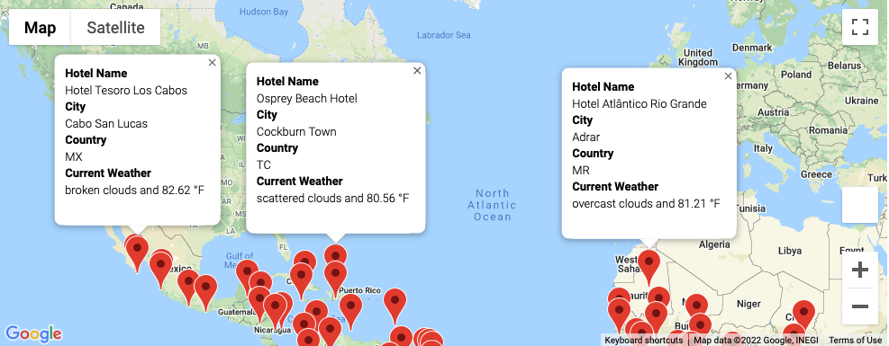
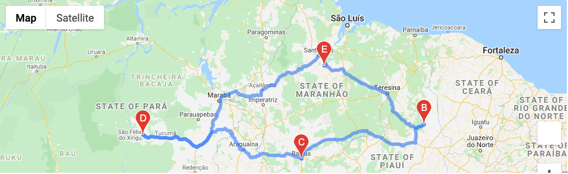
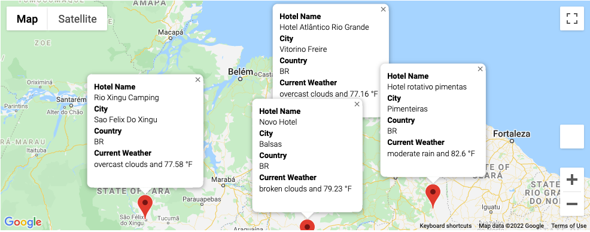

# World_Weather_Analysis

The purpose of this challenge is to provide Beta testers with examples in the PlanMyTrip app. Here, we provided a weather data dataframe from which we built a Customer Travel Destinations Map to browse vacation destinations with given weather data, as well as a sample travel itinerary with provided driving instructions for a vacation through Brazil. Some highlighted screenshots below:

